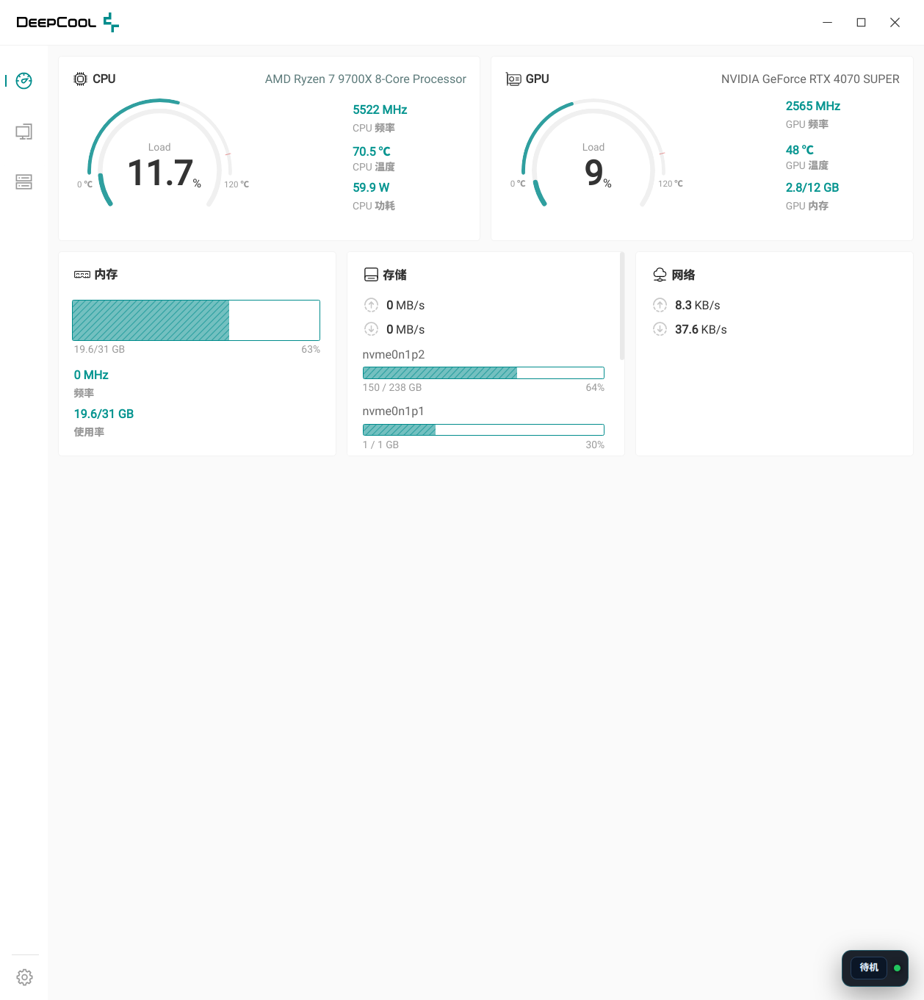
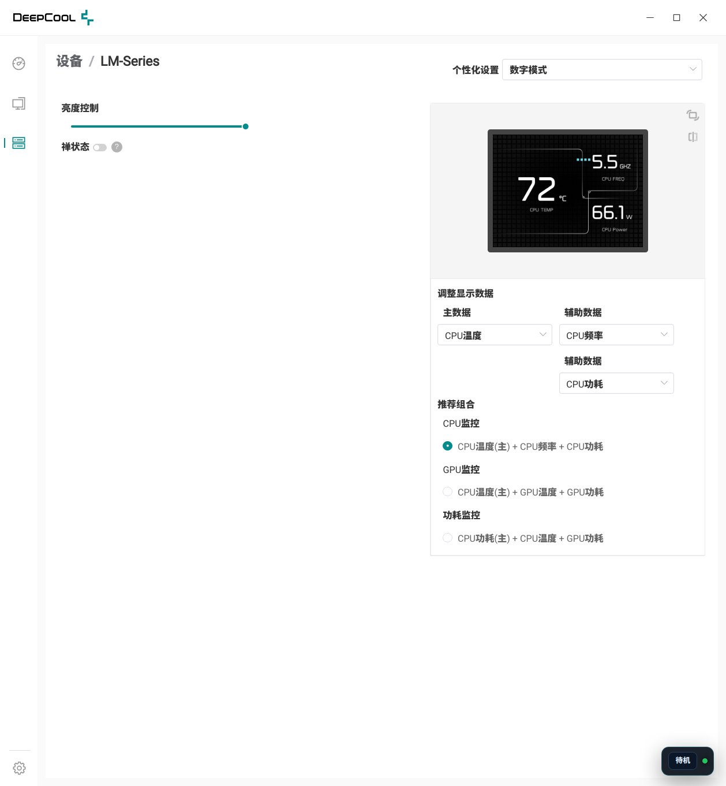

# DeepCool 1.2.12 Arch Linux 移植版

> **Description（仓库简介）**
>
> 将 DeepCool 官方 Windows 软件（NSIS + Electron 23 + Vue 3）解包移植到
> Arch Linux：原生启动官方 UI，接入 Linux 实时传感器，并把官方 L122
> "数字模式"LCD 布局（背景/图标/字体/居中/亮度）原样渲染到 320×240
> 水冷屏。支持官方预设组合、图片上传、数字/多媒体模式、禅状态待机、
> 开机自启与后台托盘运行。LCD 由本仓库自带 Python daemon 驱动。
>
> - 中文短描述：**DeepCool 官方 Windows 软件的 Arch Linux 移植版 —— 原生 UI、
>   真实传感器、官方 LCD 布局渲染与后台运行。**
> - English: **Arch Linux port of the official DeepCool (1.2.12) Windows app:
>   native Electron UI, live Linux sensors, official LM-Series LCD layout,
>   and background/tray operation.**

把目录中的 `DeepCool-1.2.12-setup.exe` 解包，在 Arch Linux 上用原生
Electron 23.3.13 启动官方 DeepCool 界面，并把 Linux 传感器与当前
LM-Series LCD daemon 接到官方 UI。

## 已验证结果

- 安装包：NSIS 3，内含 7z payload；官方应用是 Electron 23.3.13 + Vue 3。
- 主进程：`out/main/index.jsc`（V8 字节码），必须使用匹配的 Electron/V8。
- 当前真机：USB `3633:0026`，产品 `LM-Series`，Bulk OUT `0x01`、IN `0x81`。
- 官方 UI：可原生启动；仪表盘、设备列表和 LM-Series 页面均已验证。
- Linux 实时数据：CPU/GPU 温度、负载、频率、功耗、显存、内存、磁盘和网络已接入。
- LCD：官方预设/上传图片/推送预览时把当前项目画面推送到 320×240 LCD。

当前验证截图：

官方仪表盘（Linux 实时传感器）：



LM-Series 官方设备页（含 Linux 桥）：



官方布局 LCD 帧：


## 为什么不能直接运行 Windows 包

官方包中下列模块是 Windows PE32/PE32+ `.node` DLL：

- `resources/L122/index.node`（当前 LM-Series 控制器）
- `C122`、`L086`、`L136`、`L142`、`CH690`
- `system_info`、`opencv`、`ffmpeg`、`capture`、`event`
- `electron-edge-js` + HWiNFO Windows 传感器服务

Linux 无法直接加载它们。本项目用 JavaScript 桩让字节码主进程继续启动，
再通过 `patches/linux-compat.js` 覆盖 Linux 需要的 IPC：

1. 从 `/run/deepcool-lm/deepcool-lm.sock` 读取真实传感器；
2. 保留官方 USB 枚举与 LM-Series 配置 UI；
3. 使用本仓库 Python daemon 完成实际 LCD 写入。

## 运行

```bash
cd "$(dirname "$(readlink -f "$0")")"  # 或 cd 到本仓库目录
npm run bootstrap   # 首次：安装 Electron 23、解包、打补丁
npm start
```

如果当前目录已有 `work/windows-app`，`bootstrap` 会复用它。强制重新解包：

```bash
FORCE_EXTRACT=1 npm run extract
npm run port:prepare
```

运行时校验（先保持程序运行）：

```bash
npm run verify
```

## 桌面启动速度

- 启动脚本直接使用 `node_modules/electron/dist/electron`（ELF），不再经过
  `node` 包装脚本，也不依赖桌面环境的 `PATH` 里是否有 node。
- 已打过补丁时不再每次重新执行 `prepare.sh`。
- 加入单实例锁：应用已运行时再点桌面图标，会直接聚焦已有窗口并立即退出新进程。
- 桌面入口增加 `StartupNotify=true`。
- `run.sh` 内置启动重试：CDP 未就绪且进程退出时自动重试（pkill 后立即重启也稳）。

实测：干净启动到 CDP/页面就绪约 0.3–0.4 秒；重复点击立即聚焦已有窗口。

### 修复"一直停在初始加载页"

官方主进程要等 Windows 原生 `ready.node` 完成握手，才会从 `launch.html`
切到 `index.html` 主界面。Linux 桩无法触发该握手，兼容层在 `app.whenReady()`
后强制完成过渡（发送 `worker/ready`、关闭 `launch.html`、显示主窗口）。

## 功能总览（官方 UI 内控制）

所有 Linux 桥功能都已集成到官方 UI 的对应控件，无需额外操作：

| 功能 | 官方位置 | 行为 |
|---|---|---|
| **禅状态（LCD 待机）** | `设备 → LM-Series → 禅状态` 开关 | 打开 → LCD 黑屏待机（daemon zen）；关闭 → 恢复推帧 |
| **开机自启动** | `设置 → 启动设置 → 开机自启动` 开关 | 写/删 `~/.config/autostart/deepcool-official-linux.desktop`（登录后后台运行） |
| **数字/多媒体模式** | `个性化设置 → 数字模式/多媒体模式` | 多媒体 → LCD 显示图片/最近帧；数字 → 官方数字布局推帧 |
| **调整显示数据** | `个性化设置 → 调整显示数据` | 主/副数据组合实时重绘 LCD（CPU/GPU/内存等字段） |
| **图片上传** | LM-Series 媒体区 | 选图 → 裁剪缩放 320×240 → LCD 显示图片 |
| **推送预览** | 进入 LM-Series 页面自动 | 页面预览截图推送到 LCD，每秒刷新 |

右下角保留一个精简浮层：**"待机"快捷按钮** + 状态指示灯
（🟢 daemon 正常 / 🔴 不可用）。

## 开机自启 + 后台运行

登录后自动以后台模式启动（窗口隐藏、系统托盘图标、LCD 推帧继续）：

```bash
npm run install:autostart
```

移除自启：

```bash
npm run uninstall:autostart
```

**软件内控制**（官方样式）：
- 官方设置页 `设置 → 启动设置 → 开机自启动` 开关已桥接（与命令行脚本同一文件）；
- 未安装启动器时会提示先运行 `npm run install:user`。

手动后台启动：

```bash
deepcool-official-linux --hidden
# 或
npm run background
```

说明：

- 后台模式会禁用渲染节流（`setBackgroundThrottling(false)`），隐藏窗口时
  LCD 预设/图片推帧仍然每秒持续；
- 系统托盘图标：点击切换显示/隐藏，右键菜单可显示主界面或退出；
- 应用已运行时再次启动会聚焦/显示已有窗口（单实例锁）。

## 关闭窗口 = 后台运行（适配 Niri Super+Q）

- 按 **Super+Q**（或窗口管理器关闭/点击关闭按钮）**不会退出程序**，而是隐藏
  到系统托盘继续后台运行；
- LCD 渲染/推帧、传感器轮询不受影响；
- 恢复窗口：点击托盘图标 / 右键"显示主界面" / 再次运行
  `deepcool-official-linux`；
- 真正退出：托盘右键 → "退出"；
- 系统注销/关机时 `before-quit` 正常放行。

## 安装到当前用户的应用菜单

```bash
npm run install:user
```

安装后可从应用菜单打开 **DeepCool（Linux 移植版）**，或执行：

```bash
deepcool-official-linux
```

卸载启动器（不会删除项目和解包文件）：

```bash
npm run uninstall:user
```

## 依赖

- Arch Linux x86_64
- `7z`（当前系统命令来自 `7zip`）
- Node/npm（仅用于准备 Electron 运行时）
- 本项目锁定 `electron@23.3.13`
- 实际 LCD 控制依赖本仓库自带的 Python daemon（`daemon/deepcool-lm-daemon.py`，
  依赖 `python-pyusb` / `python-psutil` / `python-pillow`）

检查：

```bash
lsusb -d 3633:0026
systemctl status deepcool-lm-daemon.service
ls -l /run/deepcool-lm/deepcool-lm.sock
```

## LCD 内容由谁渲染（当前架构）

- **daemon**：本仓库 `daemon/deepcool-lm-daemon.py`（Python，systemd root 进程）。
  无原生渲染：monitor/zen 模式 LCD 纯黑，传感器始终实时采样
  （snapshot 经 `/run/deepcool-lm/deepcool-lm.sock` 提供给移植层）。
- **当前项目渲染**：官方 DeepCool UI 移植层（`linux-overlay.js`）用浏览器 Canvas
  生成 320×240 预设画面，经 `linux/push-image` 推给 daemon，daemon 把 PNG
  转 RGB565 重复发送该帧，不参与内容生成。

## daemon（Python 重写版）

原 Rust daemon（`deepcool-lm-rust`）源码已丢失（重装系统 + GitHub 无备份），
按移植层锁定的协议规格重写为 Python 单文件，协议完全兼容
（socket JSON / snapshot 字段 / image 推帧 / zen / brightness）。USB 命令来自
[daedlock/deepcool-lm](https://github.com/daedlock/deepcool-lm)（LM360 实测）。

安装/重装：

```bash
sudo bash daemon/install-daemon.sh
# 或完整重装流程：
sudo bash scripts/reinstall-daemon.sh
```

`install-daemon.sh` 会安装依赖（python-pyusb/python-psutil/python-pillow）、
安装 systemd unit、启用启动 `deepcool-lm-daemon.service`（root 运行，
自动重启，socket 0666，双实例保护）。详见 `daemon/README.md`。

### daemon 协议摘要

Unix socket `/run/deepcool-lm/deepcool-lm.sock`（0666），JSON 请求：

| 动作 | 参数 | 说明 |
|---|---|---|
| `status` | — | `{ok, mode, snapshot}`（snapshot 字段与 linux-compat 完全一致） |
| `monitor` | — | 监控模式（LCD 黑屏 + 持续采样） |
| `zen` | — | 待机（黑帧：LCD 纯黑，恢复推帧即点亮；不使用硬件 zen toggle） |
| `image` | `data`: PNG base64 | 320×240 RGB565 推帧，持续重发 |
| `brightness` | `direction`: up/down | 硬件亮度步进 |

## 图片上传（Linux 实现）

官方上传链路依赖 Windows DLL（文件对话框/opencv/L122 控制器），Linux 桩会
导致 UI 一直停在"处理中"。移植层已实现 Linux 上传：

- `media/selectImg` / `selectGif` / `selectVideo`：改用 Electron 原生文件对话框；
- `l122/uploadSelectedMedia` / `l122/modifyMedia`：用 Electron `nativeImage`
  读取图片、按官方裁剪参数裁剪并缩放 320×240，返回 `frameDataUrl`；
- overlay 收到后进入 `image` 模式：LCD 持续显示该图片，软件预览与 LCD 同一张；
- `l122/getAllMedia` / `deleteOneMedia`：维护内存媒体列表；
- 视频上传/编辑：明确提示暂不支持（不再卡死）。

## 官方 LCD 布局（已移植）

从官方 renderer（`index-8dc9d6df.js` 的 `L122Canvas2`）反编译并移植了官方
"数字模式"LCD 渲染：

- 背景：官方 `horizontal_bg-3de67705.png` / `vertical_bg-9219be0f.png`（已内嵌）；
- 图标：官方 CPU / GPU / RAM 图标（已内嵌 data URL）；
- 布局坐标、字号、颜色、进度条与官方完全一致（横屏 320×240，竖屏 240×320）；
- 主数据 70px 大字 + 单位，副数据 40px，图标 20px，CPU/负载类带 5 格进度条；
- 字体使用官方嵌入的 JZFS-Sans（主动注册，首页/自动恢复推帧也一致）；
- 主/副数据数值+单位在区域内水平居中，超宽自动缩字（不越界）。

## 统一渲染

- **只有一套渲染**：`linux-overlay.js` 的 Canvas 渲染器。
- 软件 LM-Series 页面预览（`l122/image-transmission`）不再由 main 进程生成 SVG，
  而是直接返回最近推送到 LCD 的同一张图（`lastFrameDataUrl`）。
- LCD 与软件预览显示完全一致。

## 推帧周期

- 预设/图片/预览推帧均为 **1 秒**刷新（`setInterval` 1000ms）；
- 带 in-flight 保护（上一帧未完成跳过本 tick），daemon 慢时不并发堆积；
- 亮度遮罩、lastFrameDataUrl、模式复查在统一推帧入口处理。

## 重启软件自动恢复 LCD 显示

- 保存个性化设置时写入 `preset.json`（userData），重启后自动读取并恢复
  该预设推帧（含亮度、数字/多媒体模式）。
- 验证：设置 GPU监控（亮度60）→ 重启 → 自动恢复 preset 模式、daemon static、
  推帧持续。

## 修复记录（本仓库）

详见 `docs/port-status.md`。近期的关键修复：

- **GPU 显存显示**：nvidia-smi 返回 MiB 而消费方按字节换算 → daemon 侧
  ×1048576 统一转字节，`memSize/memUsage` 恢复真实值（1.5GB/12GB）。
- **stubs thenable 挂起**：`Promise.resolve(p)` 对 thenable 自我收养导致
  `await` 永不返回 → 改为同步 resolve(undefined)。
- **推帧并发堆积**：1 秒推帧加 in-flight 保护 + capture 4s 超时。
- **多媒体模式**：捕获官方下拉点击，`modeChange` 实时切换 LCD 模式，
  重启按保存的模式恢复。
- **禅状态开关**：官方开关桥接 `linux/daemon-command zen`（黑帧待机，
  恢复推帧即点亮，不依赖硬件 zen toggle）。
- **开机自启**：官方设置页开关写/删 XDG autostart 文件（`app/set-setting`
  拦截 + 状态校准）。
- **CPU 频率单位**：daemon 上报 GHz，渲染层 ×1000 转 MHz 显示。

## 当前限制

- 这是互操作性移植，不是官方 Linux 版本。
- Windows 控制器 `.node` DLL 没有被重新编译；官方 UI 中部分高级媒体、固件更新、
  Windows HWiNFO、屏幕捕获和风扇曲线功能仍由桩处理或禁用。
- 官方 UI 的普通配置项会保存在自己的用户数据目录，但只有底部 Linux 桥明确连接
  当前 Python daemon；不要用此移植版刷固件。
- Electron 23 已停止上游维护，仅建议把它用于此离线本机界面，不要加载不可信网页。
- 安装包和官方素材版权属于 DeepCool；本目录只做本机分析与互操作，不应重新分发官方 payload。

## 目录

```text
daemon/                   Python daemon（源码备份在本仓库，不再丢失）
patches/                 字节码 loader、Windows .node 桩、Linux IPC 桥
scripts/extract.sh       NSIS/7z/asar 解包
scripts/prepare.sh       应用 Linux 补丁
scripts/run.sh           安全启动（会清理 Codex 导出的 ELECTRON_RENDERER_URL）
scripts/install-user.sh  用户级命令和 desktop entry
screenshots/             本机验证截图
docs/reverse-engineering.md  逆向记录
docs/port-status.md      移植与修复记录
work/                    解包与分析产物（不应提交/分发）
```
