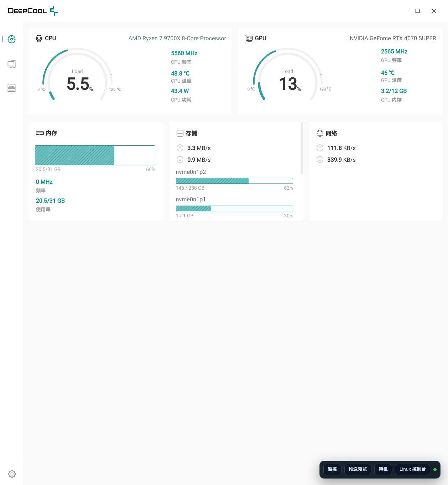
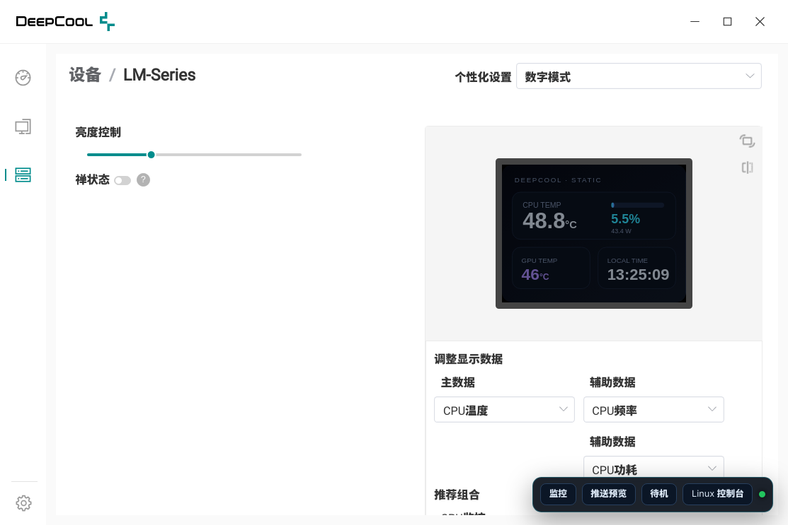
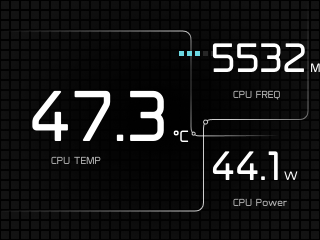

# DeepCool 1.2.12 Arch Linux 移植实验

把目录中的 `DeepCool-1.2.12-setup.exe` 解包，在 Arch Linux 上用原生
Electron 23.3.13 启动官方 DeepCool 界面，并把 Linux 传感器与当前
LM-Series LCD daemon 接到官方 UI。

## 已验证结果（2026-08-09）

- 安装包：NSIS 3，内含 7z payload；官方应用是 Electron 23.3.13 + Vue 3。
- 主进程：`out/main/index.jsc`（V8 字节码），必须使用匹配的 Electron/V8。
- 当前真机：USB `3633:0026`，产品 `LM-Series`，Bulk OUT `0x01`、IN `0x81`。
- 官方 UI：可原生启动；仪表盘、设备列表和 LM-Series 页面均已验证。
- Linux 实时数据：CPU/GPU 温度、负载、频率、功耗、显存、内存、磁盘和网络已接入。
- LCD：底部 Linux 浮层提供推送预览、待机、Linux 控制台；官方预设/上传图片/推送预览时把当前项目画面推送到 320×240 LCD。

当前验证截图：

官方仪表盘（Linux 实时传感器）：



LM-Series 官方设备页（含 Linux 桥）：



## 为什么不能直接运行 Windows 包

官方包中下列模块是 Windows PE32/PE32+ `.node` DLL：

- `resources/L122/index.node`（当前 LM-Series 控制器）
- `C122`、`L086`、`L136`、`L142`、`CH690`
- `system_info`、`opencv`、`ffmpeg`、`capture`、`event`
- `electron-edge-js` + HWiNFO Windows 传感器服务

Linux 无法直接加载它们。本项目用 JavaScript 桩让字节码主进程继续启动，
再通过 `patches/linux-compat.js` 覆盖 Linux 需要的 IPC：

1. 从 `/run/deepcool-lm/deepcool-lm.sock` 读取真实传感器；
2. 保留官方 USB 枚举与 LM-Series 配置 UI；
3. 使用已安装的 `deepcool-lm-daemon` 完成实际 LCD 写入。

## 运行

```bash
cd "$(dirname "$(readlink -f "$0")")"  # 或 cd 到本仓库目录
npm run bootstrap   # 首次：安装 Electron 23、解包、打补丁
npm start
```

如果当前目录已有 `work/windows-app`，`bootstrap` 会复用它。强制重新解包：

```bash
FORCE_EXTRACT=1 npm run extract
npm run port:prepare
```

运行时校验（先保持程序运行）：

```bash
npm run verify
```

## 桌面启动速度

- 启动脚本现在直接使用 `node_modules/electron/dist/electron`（ELF），不再经过
  `node` 包装脚本，也不依赖桌面环境的 `PATH` 里是否有 node。
- 已打过补丁时不再每次重新执行 `prepare.sh`。
- 加入单实例锁：应用已运行时再点桌面图标，会直接聚焦已有窗口并立即退出新进程，
  不会卡在 Chromium profile 锁上等待（这是桌面重复点击“启动很慢”的主要原因）。
- 桌面入口增加 `StartupNotify=true`，窗口出现前桌面环境会显示启动反馈。

实测：干净启动到 CDP/页面就绪约 0.3–0.4 秒；重复点击立即聚焦已有窗口。

### 修复“一直停在初始加载页”

官方主进程要等 Windows 原生 `ready.node` 完成握手，才会从 `launch.html`
（初始加载页）切到 `index.html` 主界面。Linux 桩无法触发该握手，因此以前会
一直停留在加载页。兼容层现在在 `app.whenReady()` 后强制完成过渡：

1. 向渲染进程发送官方 `worker/ready` 事件；
2. 关闭 `launch.html` 加载窗口；
3. 显示并聚焦主窗口（`index.html`）。

当前窗口已验证：只剩主界面一个窗口，`launch.html` 已关闭。

## 开机自启 + 后台运行

登录后自动以后台模式启动（窗口隐藏、系统托盘图标、LCD 推帧继续）：

```bash
cd "$(dirname "$(readlink -f "$0")")"  # 或 cd 到本仓库目录
npm run install:autostart
```

移除自启：

```bash
npm run uninstall:autostart
```

手动后台启动一次：

```bash
deepcool-official-linux --hidden
# 或
npm run background
```

说明：

- 后台模式会禁用渲染节流（`setBackgroundThrottling(false)`），隐藏窗口时
  LCD 预设/图片推帧仍然每 3 秒持续；
- 系统托盘图标：点击切换显示/隐藏，右键菜单可显示主界面或退出；
- 应用已运行时再次启动会聚焦/显示已有窗口（单实例锁），不会重复后台进程。

## 安装到当前用户的应用菜单

```bash
npm run install:user
```

安装后可从应用菜单打开 **DeepCool（Linux 移植版）**，或执行：

```bash
deepcool-official-linux
```

卸载启动器（不会删除项目和解包文件）：

```bash
npm run uninstall:user
```

## LCD 操作

官方窗口右下角增加了四个 Linux 桥按钮：

- **推送预览已集成到软件**：进入 `设备 → LM-Series` 页面后，自动把页面预览
  截图推送到 LCD（立即生效，无需任何按钮）；
- **待机**：右下角唯一按钮，LCD 进入 Zen/待机并保持关闭（不会被自动预览打扰），
  保存预设/上传图片后自动恢复；
- ~~Linux 控制台~~：已移除；
- ~~监控~~：已移除（不再有监控画面/监控按钮）。

## 依赖

- Arch Linux x86_64
- `7z`（当前系统命令来自 `7zip`）
- Node/npm（仅用于准备 Electron 运行时）
- 本项目锁定 `electron@23.3.13`
- 实际 LCD 控制依赖当前已安装并运行的 `deepcool-lm-rust` / `deepcool-lm-daemon`

检查：

```bash
lsusb -d 3633:0026
systemctl status deepcool-lm-daemon.service
ls -l /run/deepcool-lm/deepcool-lm.sock
```

## LCD 内容由谁渲染（当前架构）

- **原生 Slint 画面**：由 `/usr/bin/deepcool-lm-daemon`（systemd root 进程）内嵌的
  `deepcool-lm-slint` 软件渲染器渲染，不依赖浏览器/GPU；monitor/auto 模式下每 2 秒
  渲染 320×240 RGB565 帧并直接写 USB。
- **当前项目渲染**：官方 DeepCool UI 移植层（`linux-overlay.js`）用浏览器 Canvas
  生成 320×240 预设画面，经 `linux/push-image` 推给 daemon，daemon 进入 `static`
  模式只负责重复发送该帧，不参与内容生成。
- `deepcool-lm-web` 只是 HTTP 控制台/API，不渲染 LCD。

## 调整显示数据（已验证生效）

官方“个性化设置 → 调整显示数据”（主数据/辅助数据/推荐组合）保存后即生效：
overlay 捕获 `l122/modelConfigurationSet`，按 `digitalData` 组合重绘 320×240 预设画面
并推屏，软件预览与 LCD 同步。支持字段：CPU 温度/功耗/负载/频率、时间、
GPU 温度/功耗、内存负载（Memory Load，已修复支持）。

修复记录：官方“内存负载”选项原先在渲染层未映射，选中后 LCD 显示 `--`，
已补充映射（显示内存百分比）。

## 图片上传（Linux 实现，2026-08-09）

官方上传链路依赖 Windows DLL（文件对话框/opencv/L122 控制器），Linux 桩会导致
UI 一直停在“处理中”。移植层已实现 Linux 上传：

- `media/selectImg` / `selectGif` / `selectVideo`：改用 Electron 原生文件对话框；
- `l122/uploadSelectedMedia` / `l122/modifyMedia`：用 Electron `nativeImage`
  读取图片、按官方裁剪参数裁剪并缩放 320×240，返回 `frameDataUrl`；
- overlay 收到后进入 `image` 模式：LCD 持续显示该图片，软件预览与 LCD 同一张；
- `l122/getAllMedia` / `deleteOneMedia`：维护内存媒体列表；
- 视频上传/编辑：明确提示暂不支持（不再卡死）。

## 官方 LCD 布局（已移植，2026-08-09）

从官方 renderer（`index-8dc9d6df.js` 的 `L122Canvas2`）反编译并移植了官方
“数字模式”LCD 渲染：

- 背景：官方 `horizontal_bg-3de67705.png` / `vertical_bg-9219be0f.png`（已内嵌）；
- 图标：官方 CPU / GPU / RAM 图标（已内嵌 data URL）；
- 布局坐标、字号、颜色、进度条与官方完全一致（横屏 320×240，竖屏 240×320）；
- 主数据 70px 大字 + 单位，副数据 40px，图标 20px，CPU/负载类带 5 格进度条；
- 字体使用官方嵌入的 JZFS-Sans。

当前项目渲染的预设帧（320×240）：



## 统一渲染（2026-08-09）

- **只有一套渲染**：`linux-overlay.js` 的 Canvas 渲染器。
- 软件 LM-Series 页面预览（`l122/image-transmission`）不再由 main 进程生成 SVG，
  而是直接返回最近推送到 LCD 的同一张图（`lastFrameDataUrl`）。
- LCD 与软件预览显示完全一致（已验证 `img.src === lastFrame`）。
- main 进程中的 SVG 预览渲染已移除，改为静态占位。

## 只保留当前项目渲染（已默认启用）

`scripts/disable-native-render.sh` 会把 `/etc/deepcool-lm/lcd.json` 设为：

```json
{
  "renderer": "rust",
  "background": [0, 0, 0],
  "pages": [{ "name": "blank", "widgets": [] }]
}
```

效果：

- daemon 不再加载 Slint 渲染器；
- monitor 模式渲染纯黑（没有任何原生监控画面）；
- 官方预设/推送激活时进入 `static`，LCD 只显示当前项目推送的内容；
- 传感器在 static 模式下依然实时（需要包含 static 采样的新版 daemon 包，
  当前已安装的 21:27 构建已包含）。

重新执行 `scripts/reinstall-daemon.sh` 后会自动再次应用该配置。

## 官方预设的屏幕个性化设置（可用）

官方 LM-Series 页面的“个性化设置 / 调整显示数据 / 推荐组合”现在会真正作用于 LCD：

1. 在官方 UI 选择推荐组合（CPU监控 / GPU监控 / 功耗监控）或手动改主/副数据；
2. 保存后，Linux 桥按官方 `digitalData` 组合实时生成 320×240 画面
   （主数据大卡 + 两个副数据卡，支持 0/90/180/270 旋转）；
3. 每 3 秒持续推送到 LCD（与官方 image-transmission 机制一致，无需 root）。

已验证：模拟 CPU监控 / GPU监控 组合，daemon 返回 `图片已显示`，LCD 处于
`static` 模式持续显示预设画面。

已知限制：

- 亮度滑块：当前 daemon 只支持 up/down 步进，无法设置绝对值，暂不映射；
- 禅状态/强制禅：保存后桥会切到待机（Zen）；
- 点击右下角“待机”可停止预设推帧并关闭 LCD；默认启动不推任何画面。

## 注意：deepcool-lm-rust 包当前已被卸载

当前系统里 `deepcool-lm-rust` 包已不在（`/usr/bin/deepcool-lm-daemon`
文件被删除），但旧 daemon 进程仍在运行，所以预设推帧仍可工作。
**系统重启后 LCD 控制会失效**，请尽快重装：

```bash
cd ~/Git/DeepCool-linux   # daemon 源码仓库
MAKEPKG_NODEPS=1 ./packaging/build-rust-package.sh --nocheck
cd "$(dirname "$(readlink -f "$0")")"  # 或 cd 到本仓库目录
./scripts/reinstall-daemon.sh
```

`reinstall-daemon.sh` 会停止旧服务、安装新包、启用并重启
`deepcool-lm-daemon` / `deepcool-lm-web`，并把当前用户加入 `deepcool` 组。

## 当前限制

- 这是互操作性移植，不是官方 Linux 版本。
- Windows 控制器 `.node` DLL 没有被重新编译；官方 UI 中部分高级媒体、固件更新、
  Windows HWiNFO、屏幕捕获和风扇曲线功能仍由桩处理或禁用。
- 官方 UI 的普通配置项会保存在自己的用户数据目录，但只有底部 Linux 桥明确连接
  当前 Rust daemon；不要用此移植版刷固件。
- Electron 23 已停止上游维护，仅建议把它用于此离线本机界面，不要加载不可信网页。
- 安装包和官方素材版权属于 DeepCool；本目录只做本机分析与互操作，不应重新分发官方 payload。

## 目录

```text
patches/                 字节码 loader、Windows .node 桩、Linux IPC 桥
scripts/extract.sh       NSIS/7z/asar 解包
scripts/prepare.sh       应用 Linux 补丁
scripts/run.sh           安全启动（会清理 Codex 导出的 ELECTRON_RENDERER_URL）
scripts/install-user.sh  用户级命令和 desktop entry
screenshots/             本机验证截图
docs/reverse-engineering.md  逆向记录
work/                    解包与分析产物（不应提交/分发）
```
